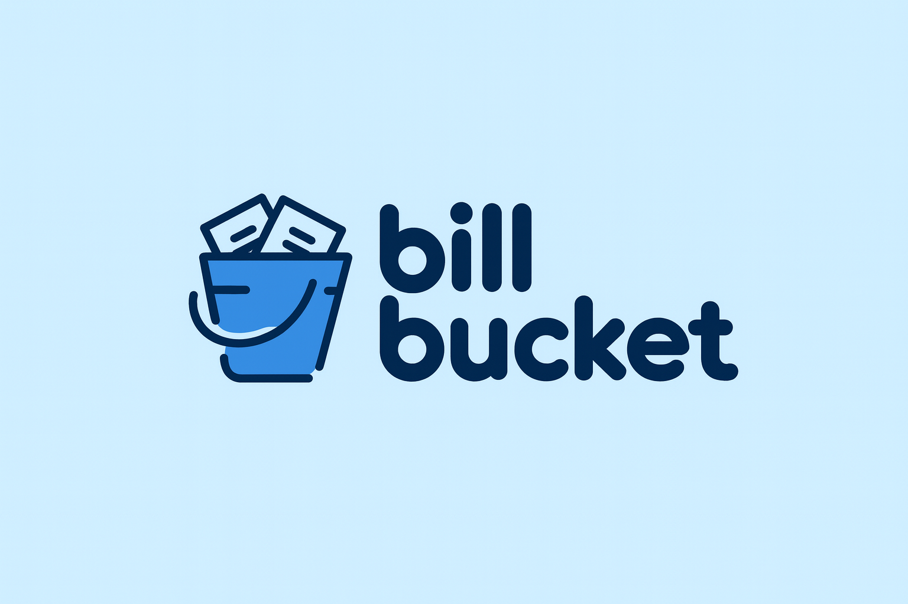
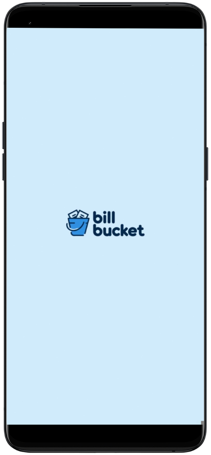
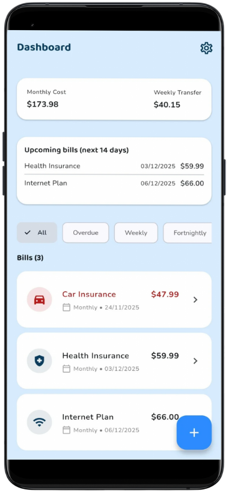
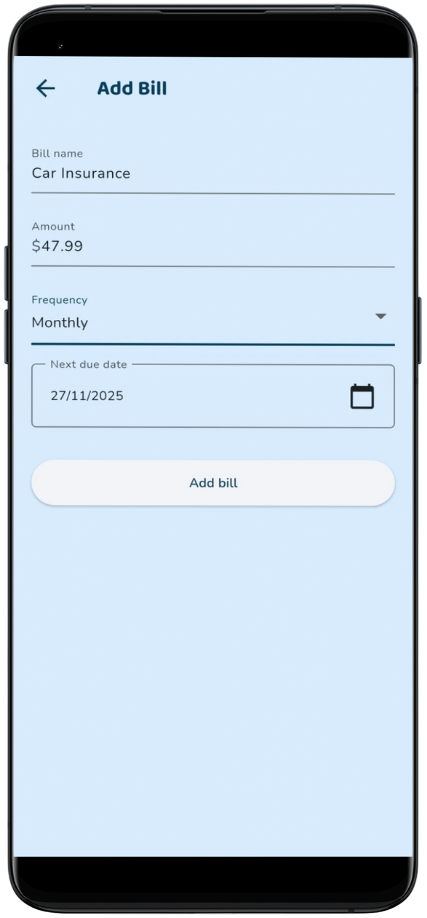
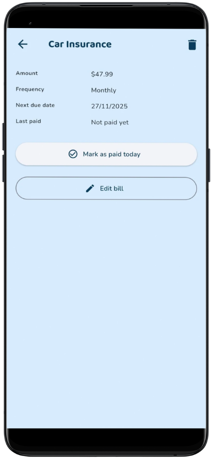
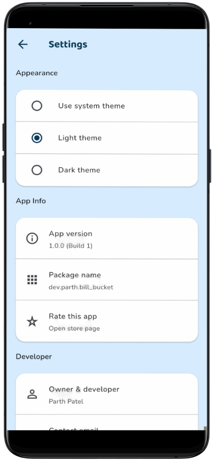

<div align="center">



# 💰 Bill Bucket

**A beautiful, intuitive Flutter app to manage your recurring bills and plan your finances with ease.**

[](https://flutter.dev)
[](https://dart.dev)
[](LICENSE)
[](pubspec.yaml)
[](https://github.com/Parth-Patel01/BillBucket)

[Features](#-features) • [Screenshots](#-screenshots) • [Installation](#-installation) • [Usage](#-usage) • [Tech Stack](#-tech-stack) • [Architecture](#-architecture) • [Contributing](#-contributing)

</div>

---

## 📖 About

**Bill Bucket** is a modern, offline-first mobile application designed to help you effortlessly manage your recurring bills. Whether you're tracking weekly subscriptions, monthly utilities, or yearly insurance payments, Bill Bucket provides a clean, intuitive interface to keep your finances organized.

With smart calculations for monthly costs and recommended weekly transfers, you'll always know how much to set aside for your bills account. The app features beautiful custom theming, smooth animations, and a robust data persistence layer that works completely offline.

## ✨ Features

### 🎯 Core Functionality
- **📝 Bill Management**: Add, edit, and delete recurring bills with ease
- **📅 Smart Due Dates**: Track next due dates with automatic calculations based on frequency
- **💰 Financial Insights**: 
  - Calculate total monthly cost across all bills
  - Get recommended weekly transfer amounts
  - View upcoming bills in the next 14 days
- **✅ Payment Tracking**: Mark bills as paid and automatically calculate next due date
- **🔄 Undo Support**: Easily undo payments or restore deleted bills

### 🎨 User Experience
- **🌓 Theme Support**: Beautiful light and dark themes with system preference detection
- **🎭 Custom Branding**: Elegant typography using Baloo2 and Nunito fonts
- **📱 Responsive Design**: Optimized for all screen sizes
- **⚡ Smooth Animations**: Polished interactions with haptic feedback
- **🔍 Smart Filtering**: Filter bills by frequency or view overdue items
- **📊 Visual Indicators**: Color-coded overdue bills and intuitive icons

### 💾 Data Management
- **🔒 Offline-First**: All data stored locally using Hive
- **💪 Persistent Storage**: Your bills are saved securely on your device
- **🚀 Fast Performance**: Instant load times with efficient data structures
- **🔄 State Management**: Clean architecture with Provider pattern

## 📸 Screenshots

<div align="center">

<table>
  <tr>
    <td align="center" colspan="2">
      
    </td>
    <td align="center" colspan="2">
      
    </td>
    <td align="center" colspan="2">
      
    </td>
  </tr>
  <tr>
    <td align="center" colspan="3">
      
    </td>
    <td align="center" colspan="3">
      
    </td>
  </tr>
</table>

</div>

## 🚀 Installation

### Prerequisites

- **Flutter SDK**: 3.9.2 or higher
- **Dart SDK**: 3.9.2 or higher
- **Android Studio** / **VS Code** with Flutter extensions
- **Android SDK** (for Android development)
- **Xcode** (for iOS development, macOS only)

### Setup Instructions

1. **Clone the repository**
   ```bash
   git clone https://github.com/Parth-Patel01/BillBucket.git
   cd BillBucket
   ```

2. **Install dependencies**
   ```bash
   flutter pub get
   ```

3. **Generate Hive adapters** (if needed)
   ```bash
   flutter pub run build_runner build --delete-conflicting-outputs
   ```

4. **Run the app**
   ```bash
   flutter run
   ```

### Building for Production

**Android:**
```bash
flutter build apk --release
# or for App Bundle
flutter build appbundle --release
```

**iOS:**
```bash
flutter build ios --release
```

## 💻 Usage

### Adding a Bill

1. Tap the **+** floating action button on the dashboard
2. Enter the bill name (e.g., "Netflix Subscription")
3. Enter the amount
4. Select the frequency (Weekly, Fortnightly, Monthly, or Yearly)
5. Choose the next due date
6. Tap **Add bill**

### Managing Bills

- **View Details**: Tap any bill to see full information
- **Mark as Paid**: Open a bill and tap "Mark as paid today" to update the next due date
- **Edit**: Tap the edit button to modify bill details
- **Delete**: Swipe left on a bill or use the delete button in the detail screen
- **Filter**: Use the filter chips to view bills by frequency or overdue items

### Dashboard Features

- **Monthly Cost**: See your total monthly bill expenses at a glance
- **Weekly Transfer**: Get a recommended weekly transfer amount to cover all bills
- **Upcoming Bills**: View bills due in the next 14 days
- **Filter & Sort**: Easily find bills by frequency or sort by due date

## 🛠 Tech Stack

### Core Technologies
- **[Flutter](https://flutter.dev)** - Cross-platform UI framework
- **[Dart](https://dart.dev)** - Programming language

### State Management
- **[Provider](https://pub.dev/packages/provider)** - State management solution

### Data Persistence
- **[Hive](https://pub.dev/packages/hive)** - Fast, lightweight NoSQL database
- **[Hive Flutter](https://pub.dev/packages/hive_flutter)** - Flutter integration for Hive

### Utilities
- **[UUID](https://pub.dev/packages/uuid)** - Unique identifier generation
- **[Intl](https://pub.dev/packages/intl)** - Internationalization and formatting
- **[Package Info Plus](https://pub.dev/packages/package_info_plus)** - App metadata
- **[URL Launcher](https://pub.dev/packages/url_launcher)** - External link handling

### Development Tools
- **[Flutter Lints](https://pub.dev/packages/flutter_lints)** - Linting rules
- **[Build Runner](https://pub.dev/packages/build_runner)** - Code generation
- **[Hive Generator](https://pub.dev/packages/hive_generator)** - Hive adapter generation

## 🏗 Architecture

Bill Bucket follows a clean, maintainable architecture pattern:

```
lib/
├── main.dart                 # App entry point
├── models/                   # Data models
│   ├── bill.dart            # Bill entity
│   └── app_settings.dart    # App settings
├── providers/                # State management
│   ├── bill_provider.dart   # Bill business logic
│   └── settings_provider.dart # Settings management
├── screens/                  # UI screens
│   ├── dashboard_screen.dart
│   ├── add_edit_bill_screen.dart
│   ├── bill_detail_screen.dart
│   └── settings_screen.dart
├── widgets/                  # Reusable widgets
│   └── animated_press.dart
├── utils/                    # Utilities
│   ├── bill_icons.dart      # Icon mapping
│   └── formatters.dart     # Formatting helpers
└── theme/                    # Theming
    └── app_theme.dart       # Theme configuration
```

### Key Design Patterns

- **Provider Pattern**: Centralized state management
- **Repository Pattern**: Data access abstraction (via Hive)
- **Immutable Models**: Bill objects are immutable for safety
- **Separation of Concerns**: Clear boundaries between UI, logic, and data

## 🎨 Customization

### Themes

The app supports three theme modes:
- **System**: Follows device theme preference
- **Light**: Custom light theme with brand colors
- **Dark**: Elegant dark theme

Theme preferences are persisted locally and sync across app restarts.

### Brand Colors

- **Primary Navy**: `#0B3C5D`
- **Accent Blue**: `#2D8CFF`
- **Light Background**: `#D7ECFF`

### Typography

- **Headings**: Baloo2 (Bold, SemiBold)
- **Body Text**: Nunito (Regular, SemiBold, Bold)

## 🤝 Contributing

Contributions are welcome! Please feel free to submit a Pull Request. Here's how you can help:

1. **Fork the repository**
2. **Create your feature branch** (`git checkout -b feature/AmazingFeature`)
3. **Commit your changes** (`git commit -m 'Add some AmazingFeature'`)
4. **Push to the branch** (`git push origin feature/AmazingFeature`)
5. **Open a Pull Request**

### Guidelines

- Follow the existing code style
- Add comments for complex logic
- Update documentation as needed
- Test your changes thoroughly

## 📝 License

This project is licensed under the MIT License - see the [LICENSE](LICENSE) file for details.

## 👤 Author

**Parth Patel**

- Email: [patel.parth2201@gmail.com](mailto:patel.parth2201@gmail.com)
- GitHub: [@Parth-Patel01](https://github.com/Parth-Patel01)
- Project Link: [https://github.com/Parth-Patel01/BillBucket](https://github.com/Parth-Patel01/BillBucket)

## 🙏 Acknowledgments

- Flutter team for the amazing framework
- Hive developers for the excellent persistence solution
- All contributors and users of this project

## 📊 Project Status


### 📄 Privacy Policy

https://parth-patel01.github.io/BillBucket/privacy-policy

---

<div align="center">

**Made with ❤️ using Flutter**

⭐ Star this repo if you find it helpful!

</div>
